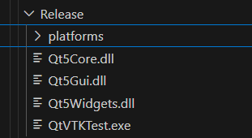
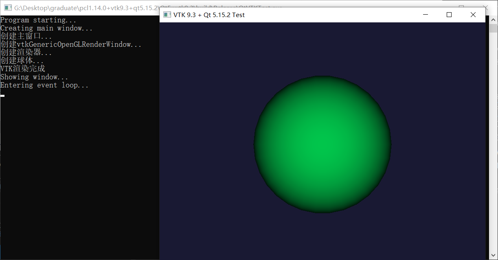

# Qt5.15.2+VTK9.3.0

我这里试过cmake的GUI进行构建和命令行进行构建，都是可以成功的，下面我采用cmake 命令行方式进行构建release版本。

首先就是修改cmakelists.txt文件，
```shell
set(CMAKE_PREFIX_PATH "I:/cpppackage/Qt/5.15.2/msvc2019_64")
set(VTK_DIR "C:/Program Files/PCL 1.14.0/3rdParty/VTK/lib/cmake/vtk-9.3")
``` 
```shell
add_custom_command(TARGET QtVTKTest POST_BUILD
    COMMAND ${CMAKE_COMMAND} -E copy_if_different
        "I:/cpppackage/Qt/5.15.2/msvc2019_64/bin/Qt5Core.dll"
        $<TARGET_FILE_DIR:QtVTKTest>
    COMMAND ${CMAKE_COMMAND} -E copy_if_different
        "I:/cpppackage/Qt/5.15.2/msvc2019_64/bin/Qt5Gui.dll"
        $<TARGET_FILE_DIR:QtVTKTest>
    COMMAND ${CMAKE_COMMAND} -E copy_if_different
        "I:/cpppackage/Qt/5.15.2/msvc2019_64/bin/Qt5Widgets.dll"
        $<TARGET_FILE_DIR:QtVTKTest>
    COMMAND ${CMAKE_COMMAND} -E make_directory
        $<TARGET_FILE_DIR:QtVTKTest>/platforms
    COMMAND ${CMAKE_COMMAND} -E copy_if_different
        "I:/cpppackage/Qt/5.15.2/msvc2019_64/plugins/platforms/qwindows.dll"
        $<TARGET_FILE_DIR:QtVTKTest>/platforms/
)
```
修改为你自己电脑上的路径。

然后你就可以进行构建了。
```shell
mkdir build && cd build
cmake ..
cmake --build . --config Release
```
如果你是构建的debug版本，就需要修改cmakelists.txt文件中的dll文件，因为debug版本的dll文件后缀是d.dll，比如Qt5Cored.dll

当你构建好后，可以看到这些文件会出现。



双击这个exe就能够执行



如果是这样说明你的环境配置没有问题。