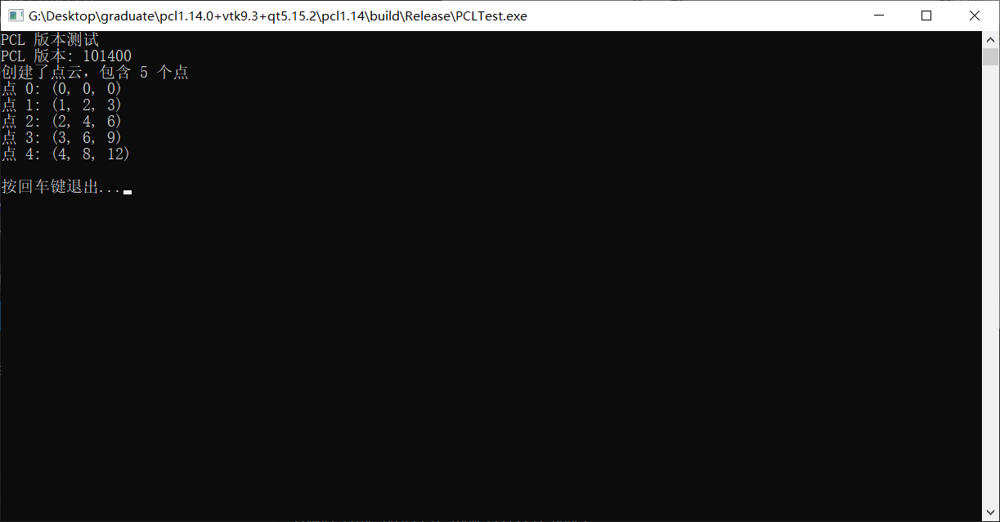
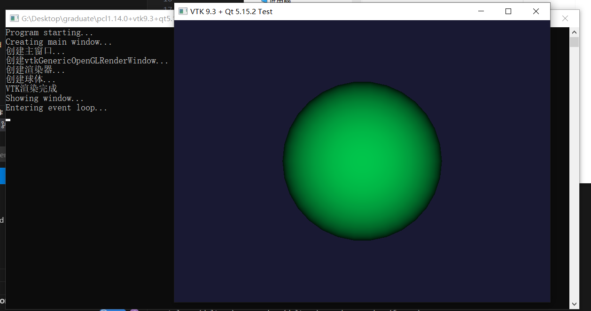
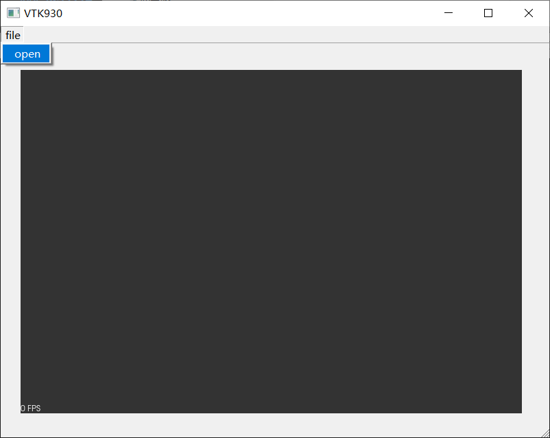
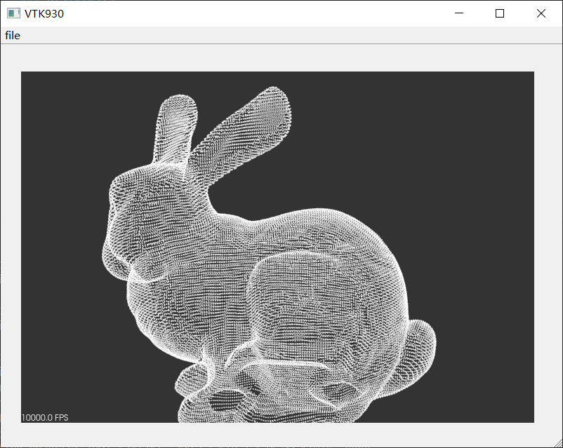

# PCL1.14.0+VTK9.3.0+Qt5.15.2的环境配置测试
这里提供了三种：
1. 只有PCL1.14.0
2. Qt + PCL1.14.0
3. PCL1.14.0 + Qt + VTK9.3.0
这三种分别提供了Cmakelists.txt文件，你可以直接进行构建。

这里需要你提前修改CMakeLists.txt中的路径。

## 构建方式
进入到各自的目录下
```shell
mkdir build && cd build
cmake ..
cmake --build . --config Release
```

## 结果
### pcl1.14



### Qt5+vtk9.3



### pcl1.14+vtk9.3+qt5.15.2






# 最后
快去试试环境对不对吧
